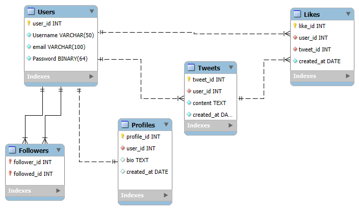

# Twitter Data Model

This project simulates a Twitter-like database schema and includes:

- **schema.sql**: Contains `CREATE TABLE`, `INSERT VALUES`, and `CREATE PROCEDURES`.
- **queries.sql**: Contains SQL queries for data manipulation and retrieval.
- **ERD_Twitter_Model.JPG**: The Entity-Relationship Diagram illustrating the database structure.

## Features

- Self-referencing relationships for followers.
- Stored procedures for creating accounts and managing follow relationships.
- Sample queries for data analysis and reporting.

## How to Use

1. **Import the Schema:**
   - Use your SQL database management tool to execute the `schema.sql` file. This will create the necessary tables and procedures.

2. **Run Queries:**
   - Execute the statements in `queries.sql` to interact with the data model and retrieve information.

## ERD Diagram

## License

This project is licensed under the MIT License.
